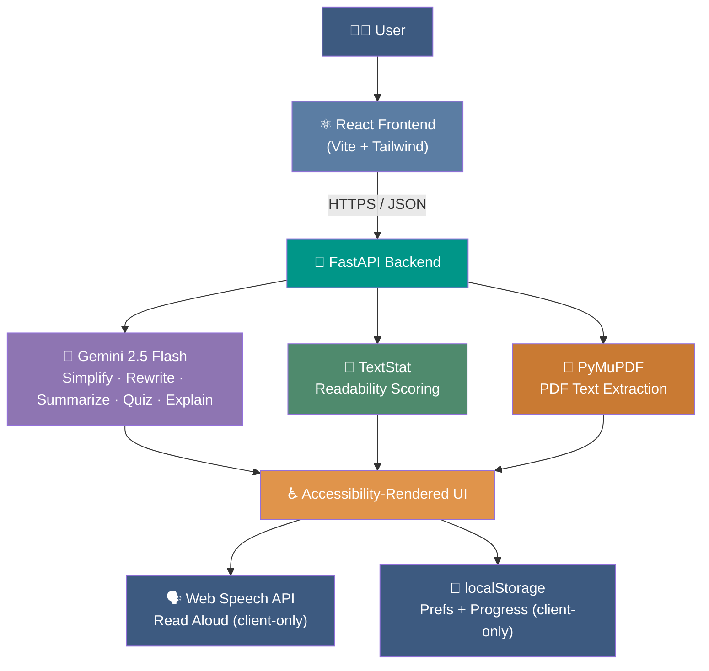
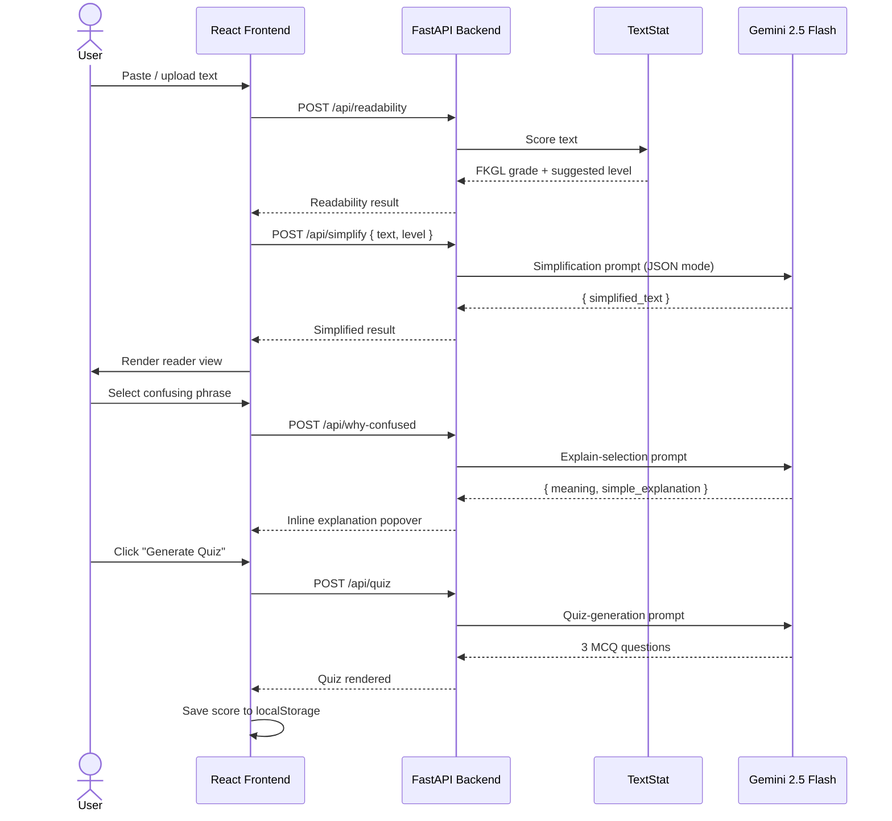

<div align="center">

# 📖 LexiFlow

### *Read It Your Way*

**An AI-powered accessibility platform that transforms complex text into personalized reading experiences.**

Built for dyslexic readers, ADHD students, English language learners, educators, and anyone who has ever stared at a wall of text and thought *"I just need this in a different format."*

[](https://react.dev/)
[](https://fastapi.tiangolo.com/)
[](https://www.python.org/)
[](https://ai.google.dev/)
[](https://tailwindcss.com/)
[](LICENSE)
[](#-accessibility-first-philosophy)

</div>

---

## 🌟 Overview

**LexiFlow doesn't dumb content down. It translates it — into the format your brain actually reads best.**

Every learner processes written language differently. A dyslexic student needs decoding support. An ADHD student needs content broken into digestible pieces. A non-native English speaker needs rigor without idiom. A teacher needs all of that, instantly, without manually rewriting a single worksheet.

Most tools solve one piece of this puzzle. **LexiFlow solves the whole workflow** — paste or upload any text and walk away with a simplified version, a dyslexia-friendly rewrite, a synced read-aloud, a summary, key points, and a comprehension quiz, all without typing a single prompt.

No accounts. No subscriptions. No server-side data storage. Your preferences and progress remain on your device.

---

## 📋 Table of Contents

- [Why LexiFlow?](#-why-lexiflow)
- [Features](#-features)
- [Tech Stack](#-tech-stack)
- [Architecture](#-architecture)
- [Request Flow](#-request-flow)
- [Screenshots](#-screenshots)
- [Installation](#-installation)
- [Folder Structure](#-folder-structure)
- [API Overview](#-api-overview)
- [Accessibility-First Philosophy](#-accessibility-first-philosophy)
- [AI Workflow Pipeline](#-ai-workflow-pipeline)
- [Project Philosophy: LexiFlow vs. ChatGPT](#-project-philosophy-lexiflow-vs-chatgpt)
- [Future Improvements](#-future-improvements)
- [Contributing](#-contributing)

---

## 🤔 Why LexiFlow?

Students with dyslexia, ADHD, autism, or limited English fluency are routinely evaluated on their ability to *decode* complex language rather than their understanding of the *ideas* inside it. That's a barrier of formatting, not intelligence — and it's a solvable one.

LexiFlow closes that gap with a single, opinionated workflow built specifically around reading accessibility, instead of a general-purpose chat window that requires the user to know exactly what to ask for, every single time.

---

## ✨ Features

<table>
<tr>
<td width="50%" valign="top">

### 📥 Input
- **📄 Upload PDF** — drag in a document, get clean extracted text
- **📋 Paste Text** — instant, no file required
- **📊 Readability Detection (FKGL)** — instant Flesch-Kincaid grade scoring, no AI call needed

### 🧠 AI Simplification
- **✂️ Simplified Mode** — ~8th-grade rewrite, rigor preserved
- **🔹 Very Simple Mode** — ~5th-grade, one idea per sentence
- **🧒 ELI5 Mode** — explained with an everyday analogy
- **🔤 Dyslexia Rewrite** — restructured for easier decoding, independent of reading level

### 🔊 Sensory Accessibility
- **▶️ Read Aloud** — synced word-by-word highlighting via the Web Speech API
- **❓ Explain Selected Text** — highlight any phrase and ask "Why am I confused?"

</td>
<td width="50%" valign="top">

### 📚 Comprehension Tools
- **📌 Key Points** — 3–5 standalone factual highlights
- **📝 AI Summary** — 2–3 sentence plain-language summary
- **🧩 AI Quiz** — 3-question comprehension check, instant feedback

### ⚙️ Accessibility Settings
- **🅰️ Font Switching** — Atkinson Hyperlegible, OpenDyslexic, Lexend, Arial
- **↕️ Adjustable Spacing** — line height, letter spacing, text size
- **🌗 Dark Mode** — soft charcoal, never pure black
- **⌨️ Keyboard Navigation** — visible focus rings everywhere

### 📈 Progress & Design
- **📊 Reading Progress Dashboard** — words read, quiz scores, day streaks
- **📱 Fully Responsive** — mobile-first, bottom-sheet accessibility panel

</td>
</tr>
</table>

---

## 🛠 Tech Stack

<table>
<tr>
<th>Layer</th>
<th>Technology</th>
<th>Purpose</th>
</tr>
<tr>
<td rowspan="6"><strong>Frontend</strong></td>
<td>React 18</td>
<td>Component architecture</td>
</tr>
<tr><td>Vite</td><td>Build tooling &amp; dev server</td></tr>
<tr><td>Tailwind CSS</td><td>Utility-first styling, dark mode, design tokens</td></tr>
<tr><td>React Router</td><td>Client-side routing across 5 pages</td></tr>
<tr><td>Context API</td><td>Global accessibility state (font, spacing, theme)</td></tr>
<tr><td>Web Speech API</td><td>Client-only Read Aloud + word highlighting</td></tr>
<tr>
<td rowspan="6"><strong>Backend</strong></td>
<td>FastAPI</td>
<td>Stateless REST API layer</td>
</tr>
<tr><td>Python 3.11+</td><td>Runtime</td></tr>
<tr><td>Google Gemini API</td><td>Simplification, rewriting, summarization, quiz generation</td></tr>
<tr><td>PyMuPDF</td><td>Server-side PDF text extraction</td></tr>
<tr><td>TextStat</td><td>Readability scoring (Flesch-Kincaid, Dale-Chall) — no AI call</td></tr>
<tr><td>Pydantic / Uvicorn</td><td>Request validation &amp; ASGI server</td></tr>
</table>

> **No database. No authentication. No vector store. No RAG.** Every request is a pure function — text in, result out, nothing persisted server-side. The only stored state lives in the browser's `localStorage`, on the user's own device.

---

## 🏗 Architecture



---

## 🔄 Request Flow

A typical "paste text → get a simplified, read-aloud-ready page" journey:



---

## 📸 Screenshots

<div align="center">

### Landing Page
<p align="center">

</p>

### Accessibility Settings


### Progress Dashboard


</div>

---

## 🚀 Installation

### Prerequisites

- [Node.js](https://nodejs.org/) 18+ and npm
- [Python](https://www.python.org/) 3.11+
- A free [Gemini API key](https://aistudio.google.com/app/apikey) from Google AI Studio

The commands below work identically on **Windows (PowerShell/CMD)** and **Linux/macOS** unless noted.

### 1. Clone the repository

```bash
git clone https://github.com/Akash-MP444/LexiFlow.git
cd lexiflow
```

### 2. Backend setup

```bash
cd lexiflow-backend

# Create a virtual environment
python -m venv .venv

# Activate it
# Linux / macOS:
source .venv/bin/activate
# Windows:
.venv\Scripts\activate

# Install dependencies
pip install -r requirements.txt

# Configure environment variables
cp .env.example .env
# Windows (no cp): copy .env.example .env
```

Open `.env` and set:

```env
GEMINI_API_KEY=your_gemini_api_key_here
GEMINI_MODEL=gemini-2.5-flash
CORS_ORIGINS=http://localhost:5173
MAX_PDF_SIZE_MB=15
MAX_TEXT_CHARS=20000
```

Run the backend:

```bash
uvicorn app.main:app --reload --port 8000
```

The API is now live at `http://localhost:8000` — interactive docs at `http://localhost:8000/docs`.

### 3. Frontend setup

Open a **new terminal** in the project root:

```bash
cd lexiflow-frontend

npm install

# Configure environment variables
cp .env.example .env
# Windows (no cp): copy .env.example .env
```

Open `.env` and confirm:

```env
VITE_API_BASE_URL=http://localhost:8000
```

Run the frontend:

```bash
npm run dev
```

Visit `http://localhost:5173` in your browser. 🎉

### 4. Production build

```bash
# Frontend
cd lexiflow-frontend
npm run build      # outputs to frontend/dist

# Backend (e.g. on Railway/Render)
uvicorn app.main:app --host 0.0.0.0 --port $PORT
```

---

## 📁 Folder Structure

```
lexiflow/
├── lexiflow-frontend/
│   ├── src/
│   │   ├── components/
│   │   │   ├── upload/          # UploadPanel, PasteTextArea
│   │   │   ├── reader/          # ReaderView, LevelTabs, DyslexiaToggle, WhyAmIConfused, KeyPointsCard
│   │   │   ├── accessibility/   # AccessibilityPanel, FontSelector, ThemeToggle
│   │   │   ├── audio/           # ReadAloud
│   │   │   ├── quiz/            # QuizView, QuestionCard
│   │   │   ├── progress/        # ProgressDashboard
│   │   │   └── common/          # NavBar, Layout
│   │   ├── context/
│   │   │   └── AccessibilityContext.jsx
│   │   ├── hooks/
│   │   │   ├── useSimplify.js
│   │   │   ├── useReadAloud.js
│   │   │   └── useLocalProgress.js
│   │   ├── lib/
│   │   │   └── api.js
│   │   ├── pages/
│   │   │   ├── Landing.jsx
│   │   │   ├── Reader.jsx
│   │   │   ├── Quiz.jsx
│   │   │   ├── Progress.jsx
│   │   │   └── Settings.jsx
│   │   ├── App.jsx
│   │   └── main.jsx
│   ├── tailwind.config.js
│   ├── vite.config.js
│   └── package.json
│
├── lexiflow-backend/
│   ├── app/
│   │   ├── main.py              # FastAPI app, CORS, router registration
│   │   ├── config.py            # Env-driven settings
│   │   ├── routers/             # One file per endpoint
│   │   ├── services/            # gemini_client, ai_tasks, pdf_extractor, readability_service
│   │   ├── schemas/             # Pydantic request/response models
│   │   ├── prompts/             # All Gemini prompt templates
│   │   └── utils/               # Validation + global error handlers
│   ├── requirements.txt
│   ├── generate_backend.sh
│   └── .env.example
│
├── screenshots/
└── README.md
```

---

## 🔌 API Overview

All endpoints are stateless `POST` routes under `/api`. Full interactive docs at `/docs`.

| Endpoint | Description | AI-Powered? |
|---|---|---|
| `POST /api/extract-pdf` | Extracts raw text from an uploaded PDF using PyMuPDF | ❌ No |
| `POST /api/readability` | Scores text with Flesch-Kincaid Grade Level and Dale-Chall, returns a suggested reading level | ❌ No |
| `POST /api/simplify` | Rewrites text at one of three levels: `simplified`, `very_simple`, or `eli5` | ✅ Gemini |
| `POST /api/dyslexia-rewrite` | Restructures sentences for easier decoding, without lowering vocabulary | ✅ Gemini |
| `POST /api/key-points` | Extracts 3–5 standalone, importance-ordered factual points | ✅ Gemini |
| `POST /api/summary` | Produces a 2–3 sentence plain-language summary | ✅ Gemini |
| `POST /api/quiz` | Generates 3 multiple-choice comprehension questions with one correct answer each | ✅ Gemini |
| `POST /api/why-confused` | Explains a user-selected word or phrase using the surrounding context | ✅ Gemini |

Every AI-powered route forces structured JSON output from Gemini (`response_mime_type: application/json`), retries once on a malformed response, and falls back to a clean error message — never a blank screen.

---

## ♿ Accessibility-First Philosophy

LexiFlow isn't an app with an accessibility *feature* — accessibility is the entire product. Every design decision works backward from a simple question: *what does this reader actually need to get from words to meaning?*

- **🔤 Dyslexia-Friendly Fonts** — OpenDyslexic, Atkinson Hyperlegible (Braille Institute), and Lexend (proven to improve reading proficiency), switchable instantly
- **↕️ Adjustable Spacing** — independent controls for line height, letter spacing, and font size, because "more space" doesn't help everyone the same way
- **🌗 Dark Mode** — soft charcoal backgrounds, never pure black or pure white, to reduce glare and eye strain
- **⌨️ Keyboard Navigation** — every interactive element is reachable and operable via keyboard, with visible focus rings at all times
- **🔊 Read Aloud** — synced word-by-word highlighting via the Web Speech API, for readers who process audio better than text
- **📊 Reading Levels** — automatic detection plus three independent AI simplification tiers, so the *right* level is one tap away instead of a guess

All preferences persist locally and apply instantly — no save button, no page reload, no account required.

---

## 🔁 AI Workflow Pipeline


Each stage is a discrete, stateless API call — nothing is cached server-side, and every step can fail independently without breaking the rest of the pipeline.

---

## 💡 Project Philosophy: LexiFlow vs. ChatGPT

A fair question for any AI-powered tool in 2026 is: *why not just use ChatGPT?*

**ChatGPT is a general-purpose assistant.** It can simplify a paragraph if you ask it correctly, but the burden of knowing *what* to ask, *how* to phrase it, and *what to do next* falls entirely on the user — every single time, in a blank text box, with no memory of what "their" reading level even is.

**LexiFlow is a dedicated accessibility platform.** It doesn't wait for a prompt — it offers a complete, pre-built workflow:

| | ChatGPT | LexiFlow |
|---|---|---|
| Requires writing a prompt | ✅ Every time | ❌ Never |
| Persistent accessibility preferences | ❌ No | ✅ Font, spacing, theme, voice speed |
| Dedicated dyslexia-decoding mode | ❌ No | ✅ Independent toggle |
| Synced read-aloud with highlighting | ❌ No | ✅ Built-in |
| One-click quiz from the *same* text | ❌ Manual prompt | ✅ One click |
| Progress tracking across sessions | ❌ No | ✅ Local, private |
| Built for a specific accessibility need | ❌ General purpose | ✅ Purpose-built |

LexiFlow integrates simplification, dyslexia support, read-aloud, summarization, and comprehension checking into **one continuous workflow** — the way a tool designed specifically for accessibility should, instead of a chatbot retrofitted to the task.

---

## 🔮 Future Improvements

- 🔍 **OCR support** for scanned PDFs and images of text
- 📚 **EPUB support** for full e-book accessibility
- 🧩 **Browser extension** for in-place page simplification on any website
- 📡 **Offline AI** via on-device small language models
- 🧑‍🏫 **Teacher Dashboard** for bulk, differentiated worksheet generation
- 📊 **Analytics** for classroom-level comprehension insights
- 🌍 **Multi-language support** for ELL scaffolding beyond English

---

## 🤝 Contributing

Contributions are what make the open-source community an incredible place to learn, build, and create. Any contribution you make is **greatly appreciated**.

1. **Fork** the repository
2. **Clone** your fork: `git clone https://github.com/Akash-MP444/LexiFlow.git`
3. **Create a branch**: `git checkout -b feature/amazing-feature`
4. **Make your changes** and commit: `git commit -m "Add amazing feature"`
5. **Push** to your branch: `git push origin feature/amazing-feature`
6. **Open a Pull Request** with a clear description of what you changed and why

---


## 👨‍💻 Author

**Akash MP**

- [GitHub](https://github.com/Akash-MP444) 
- [LinkedIn](https://www.linkedin.com/in/akash-mp444) 

---

⭐ **If you like this project, consider starring the repository!**

</div>
